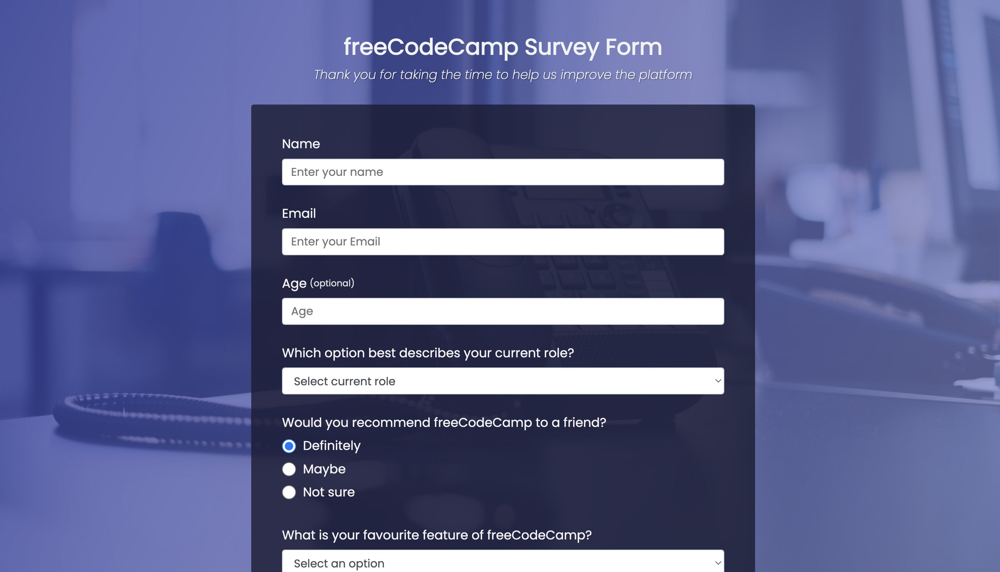
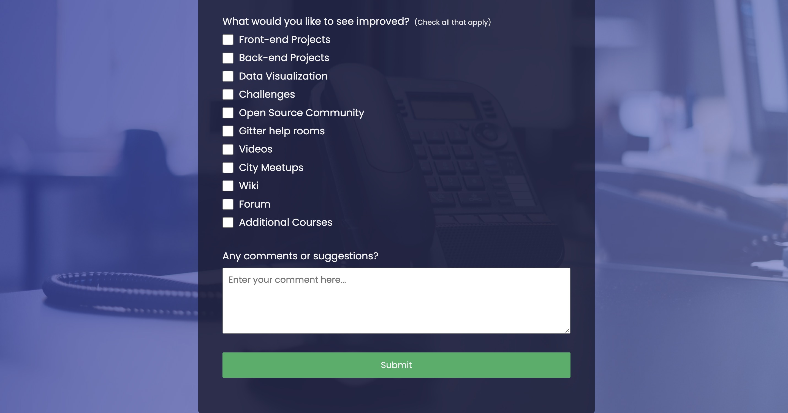

# FreeCodeCamp - Survey Form solution

This is a solution to the Survey Form Certification Project on FreeCodeCamp (https://www.freecodecamp.org/learn/2022/responsive-web-design/build-a-survey-form-project/build-a-survey-form).

## Table of contents

- [Overview](#overview)
  - [Screenshot](#screenshot)
  - [Links](#links)
- [My process](#my-process)
  - [Built with](#built-with)
  - [Continued development](#continued-development)
- [Author](#author)

## Overview

### Screenshot

### Links

- Live Site URL: (https://mcddcm.github.io/survey-form/)

## My process

### Built with

- Semantic HTML5 markup
- CSS custom properties

### Continued development

Next project will focus on delivering a mobile-first responsive page and improving accessibility features.

## Author
- Github - [@mcddcm](https://github.com/mcddcm)
